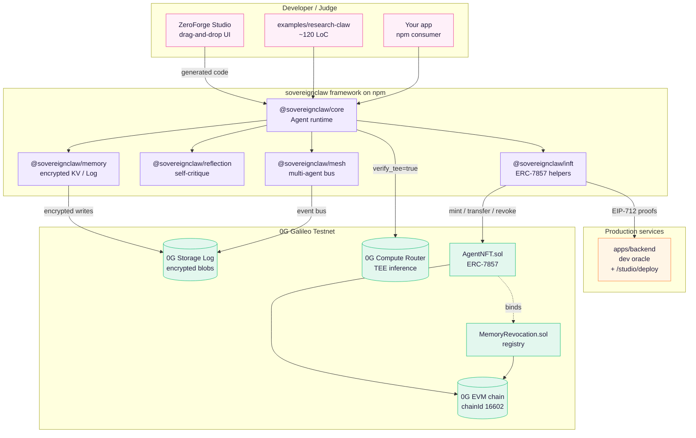
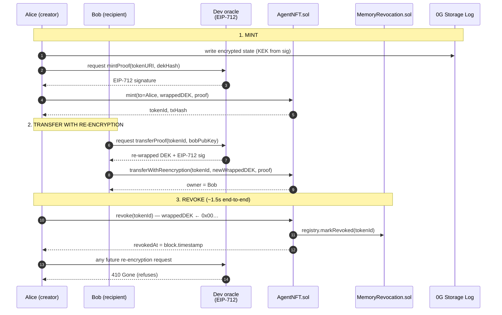
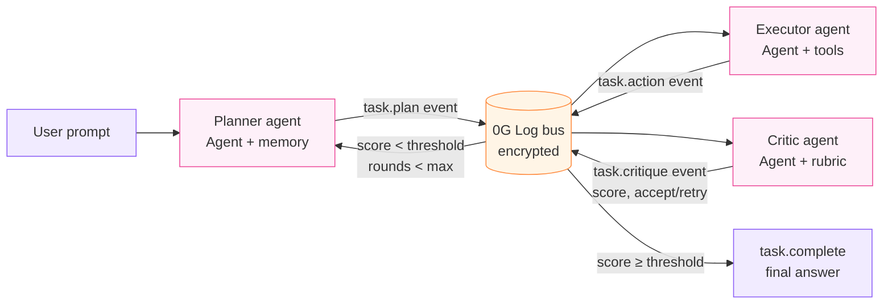

# ZeroForge, your sovereignclaw

> **Open-source, sovereign-memory, multi-agent, iNFT-native agent
> framework for 0G.** Encrypted persistent memory on 0G Storage,
> ERC-7857 iNFT lifecycle with cryptographic revocation, TEE-attested
> inference via 0G Compute Router, a multi-agent mesh on a 0G Log bus,
> and a drag-and-drop visual builder that generates the same code by
> hand. Five packages on npm, two contracts on chain, two production
> services live.

[](https://github.com/irajgill/sclaw/actions/workflows/ci.yml)
[](LICENSE)
[](https://www.npmjs.com/package/@sovereignclaw/core)
[](https://www.npmjs.com/package/@sovereignclaw/memory)
[](https://www.npmjs.com/package/@sovereignclaw/inft)
[](https://www.npmjs.com/package/@sovereignclaw/mesh)
[](https://www.npmjs.com/package/@sovereignclaw/reflection)
[](https://chainscan-galileo.0g.ai/)

**ZeroForge** is the visual side of the **sovereignclaw** stack: a
drag-and-drop builder + light, playful UX that compiles the same
TypeScript code an engineer would write by hand, then deploys a
sovereign agent (encrypted memory, TEE-attested inference, iNFT mint)
to 0G in one click.

## Status

**Phases 0 – 9 + 10 (minimal) shipped.** Five packages live on npm
(`core@0.2.0`, `memory@0.1.0`, `inft@0.1.0`, `mesh@0.2.0`,
`reflection@0.1.1`); the ZeroForge studio is a Next.js app at
[sovereignclaw-studio.vercel.app](https://sovereignclaw-studio.vercel.app);
docs at [sovereignclaw-docs.vercel.app](https://sovereignclaw-docs.vercel.app);
dev oracle + studio backend on Railway; `AgentNFT` + `MemoryRevocation`
deployed and reproducibly verified on 0G Galileo (chainId 16602).
Latest revocation number: **1.5 s** click-to-unreadable (target was <5 s).
LoC, inference, mesh, and revoke benchmarks live in
[docs/benchmarks.md](docs/benchmarks.md); audit-grade trust model in
[docs/security.md](docs/security.md); session-by-session build journal
in [docs/dev-log.md](docs/dev-log.md).

## Architecture at a glance

ZeroForge is a thin presentation layer (Next.js drag-and-drop graph +
landing demo) over the sovereignclaw runtime — five composable packages
that talk to 0G's four primitives (Storage, Compute Router, EVM chain,
ERC-7857 iNFTs) and a stateless dev oracle.



## Four snippets above the fold

```bash
# 1. Install — every package available standalone or together
pnpm add @sovereignclaw/core @sovereignclaw/memory @sovereignclaw/inft \
         @sovereignclaw/reflection @sovereignclaw/mesh ethers
```

```typescript
// 2. A sovereign agent in 8 lines: encrypted memory + TEE inference + reflection
import { Agent, sealed0GInference } from '@sovereignclaw/core';
import { encrypted, OG_Log, deriveKekFromSigner } from '@sovereignclaw/memory';
import { reflectOnOutput } from '@sovereignclaw/reflection';

const kek = await deriveKekFromSigner(wallet, 'research-claw-v1');
const memory = encrypted(
  OG_Log({ namespace: 'research-state', rpcUrl, indexerUrl, signer: wallet }),
  { kek },
);
const agent = new Agent({
  role: 'researcher',
  inference: sealed0GInference({
    model: 'qwen/qwen-2.5-7b-instruct',
    apiKey: ROUTER_KEY,
    verifiable: true,
  }),
  memory,
  reflect: reflectOnOutput({ rubric: 'accuracy', persistLearnings: true }),
});
const out = await agent.run('Summarize the three most-cited 2024 RAG papers.');
```

```typescript
// 3. Mint the agent as an ERC-7857 iNFT (one call, real on-chain tx)
import { mintAgentNFT } from '@sovereignclaw/inft';

const { tokenId, txHash, explorerUrl } = await mintAgentNFT({
  agent,
  owner: wallet,
  royaltyBps: 500,
});
console.log(`#${tokenId} → ${explorerUrl}`);
```

```typescript
// 4. Cryptographically revoke its memory (DEK zeroed on-chain in <5 s)
import { revokeMemory } from '@sovereignclaw/inft';

const { txHash, revokedAt, timings } = await revokeMemory({
  tokenId,
  owner: wallet,
  oracle, // OracleClient pointed at the production oracle on Railway
  onPhase: (p) => console.log(`${p.phase}: ${p.ms}ms`), // oracle-refuse: ~1.5s
});
// After this returns: AgentNFT.wrappedDEK is zeros, MemoryRevocation registry
// is updated, oracle refuses any future re-encryption for tokenId.
```

The full ResearchClaw example (≈120 LoC) is at
[`examples/research-claw/`](examples/research-claw/) — copy that folder
anywhere on disk, fill `.env`, `pnpm install && pnpm dev`. Verified
clone-to-iNFT under 10 minutes.

## Build & run flow (clone → sovereign iNFT)

ZeroForge is reproducible end-to-end: every box below is a real
command, a real on-chain tx, or a measured artifact committed under
`scripts/.benchmarks/`.

```mermaid
flowchart LR
    A[git clone] --> B[pnpm install]
    B --> C[forge install + build<br/>foundry-rs / OpenZeppelin]
    C --> D[pnpm build<br/>5 workspace packages]
    D --> E{run path?}
    E -->|code| F[examples/research-claw<br/>pnpm dev]
    E -->|UI| G[ZeroForge Studio<br/>localhost:3030/builder]
    F --> H[Agent.run<br/>TEE inference]
    G -->|drag &drop| I[generateCode]
    I --> J[POST /studio/deploy<br/>backend validates + bundles]
    J --> H
    H --> K[encrypted writes<br/>0G Storage Log]
    H --> L[reflectOnOutput<br/>self-critique]
    L --> M[mintAgentNFT<br/>EIP-712 + AgentNFT.mint]
    M --> N[chainscan-galileo<br/>real iNFT, real tx]

    classDef start fill:#fef0f9,stroke:#ec4899;
    classDef build fill:#fff5e6,stroke:#ff8a3d;
    classDef run fill:#f1ebff,stroke:#8b5cf6;
    classDef chain fill:#e3f7ee,stroke:#1fbf7a;
    class A,B,C,D start;
    class E,F,G,I,J build;
    class H,K,L run;
    class M,N chain;
```



## Mint → transfer → revoke lifecycle

The iNFT lifecycle is the load-bearing security story. The chain
enforces revocation; the oracle refuses re-encryption after revoke;
the on-chain `wrappedDEK` is zeroed. Every box below is a public
transaction or an EIP-712-signed proof verifiable in
`packages/inft/test/`.



## Mesh — the multi-agent bus

`@sovereignclaw/mesh` is a planner / executor / critic loop running
over the **same** encrypted 0G Log used for memory. Every bus event is
encrypted-at-rest; the namespace is per-task; the message log is
auditable on chainscan via the storage root hashes.



## Production Endpoints

| Resource                         | URL / value                                                                                          |
| -------------------------------- | ---------------------------------------------------------------------------------------------------- |
| **Docs site**                    | https://sovereignclaw-docs.vercel.app                                                                |
| **ZeroForge Studio**             | https://sovereignclaw-studio.vercel.app                                                              |
| **Dev oracle + studio backend**  | https://oracle-production-5db4.up.railway.app (Bearer auth) — `/oracle/*`, `/studio/{deploy,status}` |
| npm: `@sovereignclaw/core`       | https://www.npmjs.com/package/@sovereignclaw/core (v0.2.0)                                           |
| npm: `@sovereignclaw/memory`     | https://www.npmjs.com/package/@sovereignclaw/memory (v0.1.0)                                         |
| npm: `@sovereignclaw/mesh`       | https://www.npmjs.com/package/@sovereignclaw/mesh (v0.2.0)                                           |
| npm: `@sovereignclaw/inft`       | https://www.npmjs.com/package/@sovereignclaw/inft (v0.1.0)                                           |
| npm: `@sovereignclaw/reflection` | https://www.npmjs.com/package/@sovereignclaw/reflection (v0.1.1)                                     |
| AgentNFT contract                | [`0xc3f99…0601`](https://chainscan-galileo.0g.ai/address/0xc3f997545da4AA8E70C82Aab82ECB48722740601) |
| MemoryRevocation contract        | [`0x73508…b6AC`](https://chainscan-galileo.0g.ai/address/0x735084C861E64923576D04d678bA2f89f6fbb6AC) |
| Network                          | 0G Galileo Testnet (chainId 16602)                                                                   |

**Quick install:**

```bash
pnpm add @sovereignclaw/core @sovereignclaw/memory @sovereignclaw/inft ethers
```

**Use the production oracle:**

```typescript
import { OracleClient } from '@sovereignclaw/inft';

const oracle = new OracleClient({
  url: 'https://oracle-production-5db4.up.railway.app',
  authToken: process.env.ORACLE_AUTH_TOKEN, // request from operator
});
```

The dev oracle requires Bearer-token auth on every request. Ask the
operator for a token if you need oracle access for a downstream
project. The full production deployment record — Railway service ID,
smoke-test tx hashes, post-revoke assertions — lives in
[`deployments/oracle-prod.json`](deployments/oracle-prod.json).

**ResearchClaw — the ~120-line example** lives at
[`examples/research-claw/`](examples/research-claw/). Copy that
directory anywhere on disk, fill `.env`, run `pnpm install && pnpm dev`.
Verified clone-to-iNFT under 10 minutes.

**ZeroForge Studio — visual builder** at
[https://sovereignclaw-studio.vercel.app](https://sovereignclaw-studio.vercel.app).
Drag-and-drop graph → sovereignclaw code → one-click deploy via the
studio backend on Railway. The graph generated for ResearchClaw
produces source byte-equivalent to the example file (snapshot-tested
in `packages/studio/test/codegen.test.ts`).

**IncomeClaw — the 5-agent reference build** at
[github.com/irajgill/IncomeClaw](https://github.com/irajgill/IncomeClaw).
Track 2 submission, separate repo, consumes only the public API of
these five packages. Pinned versions: `@sovereignclaw/core@0.2.0`,
`@sovereignclaw/mesh@0.2.0`, `@sovereignclaw/inft@0.1.0`,
`@sovereignclaw/memory@0.1.0`, `@sovereignclaw/reflection@0.1.1`.

## Deployed addresses (0G Galileo Testnet, chainId `16602`)

| Contract         | Address                                      | Explorer                                                                                        |
| ---------------- | -------------------------------------------- | ----------------------------------------------------------------------------------------------- |
| AgentNFT         | `0xc3f997545da4AA8E70C82Aab82ECB48722740601` | [chainscan](https://chainscan-galileo.0g.ai/address/0xc3f997545da4AA8E70C82Aab82ECB48722740601) |
| MemoryRevocation | `0x735084C861E64923576D04d678bA2f89f6fbb6AC` | [chainscan](https://chainscan-galileo.0g.ai/address/0x735084C861E64923576D04d678bA2f89f6fbb6AC) |

Source verification on chainscan-galileo is currently manual via the
explorer UI — flattened single-file sources are committed under
[deployments/flattened/](deployments/flattened/) for upload. See
[contracts/README.md](contracts/README.md) for instructions and the
constructor-args ABI encoding. The full deployment record (tx hashes,
deployer, oracle, constructor args, oracle rotation history) lives in
[deployments/0g-testnet.json](deployments/0g-testnet.json).

Run `pnpm check:deployment` at any time to assert that the live
contract state on 0G matches the committed record (binding, oracle,
owner, name, symbol, and the `DESTROYED_SENTINEL` constant). With
`ORACLE_ADDRESS` set in env, also asserts the live
`AgentNFT.oracle()` matches your local oracle key.

## Component map — what's where

```mermaid
flowchart TD
    subgraph repo [irajgill/sclaw monorepo]
        direction TB
        subgraph pkgs [packages/]
            P_CORE[core/]
            P_MEM[memory/]
            P_INFT[inft/]
            P_MESH[mesh/]
            P_REFL[reflection/]
            P_STD[studio/ — ZeroForge Next.js]
        end
        subgraph apps [apps/]
            A_BACK[backend/ — Hono dev oracle<br/>+ /studio/deploy]
            A_DOCS[docs/ — Next.js docs site]
        end
        subgraph contracts [contracts/]
            C_AG[src/AgentNFT.sol]
            C_REV[src/MemoryRevocation.sol]
            C_TEST[test/ — 77 Foundry tests]
        end
        subgraph ex [examples/]
            E_RC[research-claw/ — DoD <120 LoC]
            E_RM[research-mesh/ — 3-agent flow]
            E_AMT[agent-mint-transfer-revoke/]
            E_AH[agent-hello/]
        end
        subgraph scripts [scripts/]
            S_BENCH[benchmark-*.ts]
            S_SMOKE[smoke-test-0g.ts]
            S_DEPLOY[deploy-contracts.ts]
        end
    end

    P_STD -->|imports| P_CORE
    A_BACK -->|imports| P_INFT
    E_RC --> P_CORE
    E_RM --> P_MESH
    S_DEPLOY --> C_AG
    S_DEPLOY --> C_REV
    C_TEST -.tests.-> C_AG
    C_TEST -.tests.-> C_REV

    classDef pkg fill:#f1ebff,stroke:#8b5cf6;
    classDef app fill:#fef0f9,stroke:#ec4899;
    classDef contract fill:#fff5e6,stroke:#ff8a3d;
    classDef example fill:#e3f7ee,stroke:#1fbf7a;
    classDef script fill:#fff7d6,stroke:#f5b942;
    class P_CORE,P_MEM,P_INFT,P_MESH,P_REFL,P_STD pkg;
    class A_BACK,A_DOCS app;
    class C_AG,C_REV,C_TEST contract;
    class E_RC,E_RM,E_AMT,E_AH example;
    class S_BENCH,S_SMOKE,S_DEPLOY script;
```



## What's built so far

| Layer                                                                                                                                 | Status                                                                                |
| ------------------------------------------------------------------------------------------------------------------------------------- | ------------------------------------------------------------------------------------- |
| v0.1.0 npm release + production oracle (Phase 10, minimal)                                                                            | Five `@sovereignclaw/*` packages on npm; dev oracle on Railway with bearer-token auth |
| `@sovereignclaw/memory` (Phase 1)                                                                                                     | Sovereign memory primitives — encrypted, revocable, 0G-Storage-backed                 |
| `@sovereignclaw/core` (Phase 1)                                                                                                       | Agent runtime, `sealed0GInference` adapter                                            |
| `AgentNFT.sol`, `MemoryRevocation.sol` (Phase 2)                                                                                      | ERC-7857 iNFT lifecycle, deployed and pinned                                          |
| [`@sovereignclaw/inft`](packages/inft/) (Phase 3)                                                                                     | Mint / transfer-with-reencryption / revoke / recordUsage helpers                      |
| [`@sovereignclaw/backend` dev oracle](apps/backend/) (Phase 3)                                                                        | Hono service signing EIP-712 oracle proofs                                            |
| [`examples/agent-mint-transfer-revoke`](examples/agent-mint-transfer-revoke/) (Phase 3)                                               | DoD example: full lifecycle on real testnet                                           |
| [`examples/research-claw`](examples/research-claw/) (Phase 4)                                                                         | DoD example: sovereign agent + TEE inference + encrypted mint, ~80 LoC                |
| [`docs/quickstart.md`](docs/quickstart.md) + `pnpm benchmark:cold-start` (Phase 4)                                                    | Clone-to-iNFT paste path, reproducible ~85s cold-start benchmark                      |
| [`@sovereignclaw/mesh`](packages/mesh/) (Phase 5)                                                                                     | Bus over 0G Log, `planExecuteCritique`, typed events, 30 unit tests                   |
| [`examples/research-mesh`](examples/research-mesh/) (Phase 5)                                                                         | DoD example: planner + executor + critic, 6 encrypted bus events on-log               |
| [`@sovereignclaw/reflection`](packages/reflection/) (Phase 6)                                                                         | `reflectOnOutput()`, 4 built-in rubrics, learnings persistence, 35 unit tests         |
| `reflect: reflectOnOutput({...})` in ResearchClaw (Phase 6)                                                                           | Self-critique on every run; `learning:<runId>` queryable via `listRecentLearnings`    |
| [`@sovereignclaw/studio`](packages/studio/) (Phase 7) — **ZeroForge**                                                                 | Next.js drag-and-drop builder, 6 node types, pure codegen, Monaco preview             |
| `/studio/deploy` + `/studio/status/:id` in backend (Phase 7)                                                                          | esbuild-validates generated code, writes manifest to 0G, mints one iNFT per agent     |
| `pnpm smoke:studio` (Phase 7)                                                                                                         | Reproducible DoD: seed graph → 3 real iNFTs minted on 0G in ~60s                      |
| Per-package READMEs for `memory / core / inft / mesh / reflection` (Phase 8)                                                          | Install + 10-line quickstart + API table + errors table + links                       |
| [`docs/architecture.md`](docs/architecture.md) (Phase 8)                                                                              | Layered stack diagram, build/run/revoke data flows, trust model                       |
| [`docs/benchmarks.md`](docs/benchmarks.md) + `pnpm benchmark:{loc,inference-rtt,revoke-latency,mesh-throughput,cold-start}` (Phase 8) | Five live-testnet benchmarks; raw JSON committed under `scripts/.benchmarks/`         |
| `revokeMemory` phase instrumentation (Phase 9)                                                                                        | `onPhase` hook + `timings` result; oracle-side refuse now **1.5 s** (<5 s target)     |
| Studio wallet-connect + EIP-712 deploy auth (Phase 9)                                                                                 | Header connect, typed-data sign, backend `STUDIO_SIGNER_ALLOWLIST`, open-mode dev     |
| Server-side codegen echo diff (Phase 9)                                                                                               | Rejects tampered client source before gas; CRLF/newline-tolerant, line-diffed 400     |
| Custom reflection rubrics (Phase 9)                                                                                                   | Inspector textarea for `{ name, description, criteria }`; literal object emitted      |
| [`docs/security.md`](docs/security.md) audit-grade (Phase 9)                                                                          | Attacker-capability threat model, primitives table, L1–L12 production-gap ledger      |
| CI LoC gate (Phase 9)                                                                                                                 | `.github/workflows/ci.yml` runs `pnpm benchmark:loc --check` on every PR              |
| ZeroForge light + playful re-skin (Phase 10)                                                                                          | New design language across studio, landing demo, and docs — light cream / pastel-pop  |

## Quickstart — clone → sovereign iNFT on 0G Galileo in <90 seconds

The full paste-able quickstart lives in
[docs/quickstart.md](docs/quickstart.md). The short form:

```bash
git clone https://github.com/irajgill/sclaw.git
cd sclaw
cp .env.example .env
# Fill PRIVATE_KEY (funded wallet from https://faucet.0g.ai) and
# COMPUTE_ROUTER_API_KEY (from https://pc.testnet.0g.ai).

pnpm install
( cd contracts && forge install foundry-rs/forge-std --no-git \
                       && forge install OpenZeppelin/openzeppelin-contracts --no-git \
                       && forge build )
pnpm --filter @sovereignclaw/core --filter @sovereignclaw/memory \
     --filter @sovereignclaw/reflection --filter @sovereignclaw/inft build

cd examples/research-claw && pnpm dev
# Prints TEE-verified inference, a self-critique (reflect.complete with
# score + learningPointer), four encrypted 0G writes, and a chainscan
# URL for your freshly-minted ResearchClaw iNFT.
```

For the full **mint → transfer → revoke** lifecycle (Phase 3, requires
the dev oracle and a second wallet), see
[`examples/agent-mint-transfer-revoke`](examples/agent-mint-transfer-revoke/).

For the **3-agent mesh** flow (Phase 5), once the core + memory + mesh
packages are built:

```bash
pnpm --filter @sovereignclaw/core --filter @sovereignclaw/memory --filter @sovereignclaw/mesh build
cd examples/research-mesh && pnpm dev
# Prints 6 bus events with their 0G root hashes + storagescan URLs, then
# the accepted final answer, score, and round count.
```

For the **visual builder** (Phase 7, ZeroForge Studio): the studio is
a Next.js app that talks to the backend for deploys.

```bash
# terminal 1
pnpm --filter @sovereignclaw/backend dev
# starts http://localhost:8787 with /studio/* routes enabled as long as
# RPC_URL, INDEXER_URL, and PRIVATE_KEY (or STUDIO_MINTER_PRIVATE_KEY)
# are set in .env.

# terminal 2
pnpm --filter @sovereignclaw/studio dev
# open http://localhost:3030 — the 3-agent research swarm is pre-loaded;
# click Deploy to mint 3 real iNFTs on 0G Galileo in ~60s.

# headless (CI or a fast sanity check)
pnpm smoke:studio
# POSTs the seed graph to the running backend, polls until done, prints
# manifest root + chainscan URLs for every minted iNFT.
```

Reproduce the DX numbers on your own machine:

```bash
pnpm benchmark:cold-start          # wall-time each step, writes JSON report
pnpm benchmark:cold-start --clean  # true cold: wipes node_modules first
```

## Phase 3 highlights

- **EIP-712 byte-equality** between the on-chain `_verifyOracleProof`
  and off-chain `digestForOracleProof` is enforced via a Foundry-emitted
  fixture ([deployments/eip712-typehashes.json](deployments/eip712-typehashes.json))
  that both sides re-derive locally and compare. Drift on either side
  fails CI.
- **Dev oracle** at [apps/backend/](apps/backend/): four endpoints,
  EIP-712-signed proofs, optional bearer auth, dockerized, persistence-
  gap documented at the top of `src/store.ts`.
- **`@sovereignclaw/inft`** ships only ABI JSON + EIP-712 helpers +
  ethers bindings. Zero `@sovereignclaw/core` dep. Typed errors
  throughout.
- **Honest revocation semantics** are spelled out in
  [docs/security.md](docs/security.md): the chain-enforced parts (DEK
  zeroed, oracle refuses, registry public) and the can-never-happen
  parts (recovering a DEK already in someone's session memory, deleting
  the ciphertext from immutable storage).

## Tests

- **77 Foundry tests** across 7 suites (AgentNFT happy path + AgentNFT
  fuzz + AgentNFT invariants × 128 k handler calls per property +
  MemoryRevocation + Deploy script + EIP-712 emitter + Ping). Gas
  snapshot committed at [contracts/.gas-snapshot](contracts/.gas-snapshot)
  and gated in CI.
- **123 Vitest unit tests** (35 inft + 39 backend + 18 studio + memory
  - core + mesh + reflection). EIP-712 byte-equality and tamper-
    detection assertions in both inft and backend.
- **Integration tests against real testnet** (mint + transfer + revoke
  - post-revoke 410). Bootable in CI via the
    [`run-integration` PR label](.github/workflows/integration.yml).

```bash
pnpm contracts:test                 # all 77 Foundry tests
pnpm contracts:snapshot:check       # gas regression gate
pnpm test                           # 123 unit suites across the workspace
pnpm benchmark:loc --check          # LoC budget gate (fails CI if exceeded)
INTEGRATION=1 pnpm --filter @sovereignclaw/inft test:integration
pnpm check:deployment               # read-only on-chain assertions
```

## 0G features used

| Layer                         | Where                                                           | Notes                                                                                                                                               |
| ----------------------------- | --------------------------------------------------------------- | --------------------------------------------------------------------------------------------------------------------------------------------------- |
| **Storage Log**               | `@sovereignclaw/memory` (`OG_Log`), `@sovereignclaw/mesh` (bus) | Encrypted (AES-256-GCM, KEK from wallet sig) sovereign-memory writes; per-task mesh-bus namespaces                                                  |
| **Compute Router**            | `@sovereignclaw/core` (`sealed0GInference`)                     | OpenAI-compatible HTTPS gateway; `verify_tee: true` → `tee_verified` + provider address surfaced as typed `Attestation` on every `InferenceResult`  |
| **Chain (EVM)**               | `AgentNFT.sol` + `MemoryRevocation.sol`                         | Galileo testnet (chainId 16602); `transferWithReencryption`, `revoke`, `recordUsage` all real txs verifiable on chainscan-galileo                   |
| **ERC-7857 iNFT pattern**     | `@sovereignclaw/inft`                                           | mint/transfer/revoke/recordUsage helpers; EIP-712 oracle proofs with per-token monotonic nonces; `onPhase` timing instrumentation                   |
| **MemoryRevocation registry** | `MemoryRevocation.sol`, `pnpm check:deployment`                 | Public on-chain registry of revoked tokens; bound immutably to `AgentNFT`; queryable from any client without paying for the full NFT storage layout |

## Companion repo (Track 2)

**IncomeClaw — five sovereign agents on 0G:**
[github.com/irajgill/IncomeClaw](https://github.com/irajgill/IncomeClaw).
A 5-agent autonomous income team (Brain · Strategist · Opener · Closer
· Operator), each minted as an iNFT, each with its own encrypted
memory, communicating through the `@sovereignclaw/mesh`. The Track 2
submission and the production consumer of this framework's public API.
Pinned versions: `@sovereignclaw/core@0.2.0`,
`@sovereignclaw/mesh@0.2.0`, `@sovereignclaw/inft@0.1.0`,
`@sovereignclaw/memory@0.1.0`, `@sovereignclaw/reflection@0.1.1`.

## Demo

- **Live ZeroForge Studio:** https://sovereignclaw-studio.vercel.app —
  drag-build a 3-agent research swarm, click Deploy, watch three real
  iNFTs land on chainscan-galileo in ~60 s.
- **Live docs:** https://sovereignclaw-docs.vercel.app
- **Demo video:** _to be uploaded by submission deadline (≤3 min)._
  Will walk: `pnpm install` → ResearchClaw run with TEE attestation +
  reflection learning → mint → revoke (chainscan-verifiable) →
  ZeroForge drag-build → 3 iNFTs on chain.

## Submission checklist

The full Track 1 submission checklist (`claude.md` §17) is exercised
in this repo. Boxes ticked at submission time:

- [x] Project name: **ZeroForge, your sovereignclaw**
- [x] One-paragraph description (top of this README)
- [x] Public GitHub repo URL: https://github.com/irajgill/sclaw
- [x] README quality (4 above-the-fold snippets, 4 mermaid diagrams, badges, architecture link, package list)
- [x] Per-package READMEs for `core / memory / inft / mesh / reflection`
- [x] [`docs/quickstart.md`](docs/quickstart.md) (verified <10 min path)
- [x] [`docs/architecture.md`](docs/architecture.md) (layered diagram + data flows)
- [x] [`docs/benchmarks.md`](docs/benchmarks.md) (measured numbers + reproducible scripts)
- [x] [`docs/security.md`](docs/security.md) (audit-grade trust model + L1–L12 production-gap ledger)
- [x] Working ResearchClaw example, runnable from a clean clone
- [x] Link to IncomeClaw repo (Track 2)
- [x] Contract addresses on 0G explorer + recorded in [`deployments/0g-testnet.json`](deployments/0g-testnet.json) (manual verification status documented honestly)
- [ ] Demo video uploaded to YouTube, ≤3 min, link added here
- [x] Live demo URL (ZeroForge Studio on Vercel), tested from incognito
- [x] List of 0G features used (table above)
- [ ] Team contacts (Telegram + X handles below)
- [x] LICENSE file (Apache 2.0)
- [x] All packages installable via `pnpm add @sovereignclaw/*`
- [x] CI badges in this README

## Team / Contact

| Channel                           | Handle                                                          |
| --------------------------------- | --------------------------------------------------------------- |
| Telegram                          | _add before submission_                                         |
| X (Twitter)                       | _add before submission_                                         |
| GitHub issues                     | https://github.com/irajgill/sclaw/issues                        |
| Responsible disclosure (security) | see [docs/security.md](docs/security.md#responsible-disclosure) |

## License

Apache 2.0. See [LICENSE](LICENSE) and [NOTICE](NOTICE).
