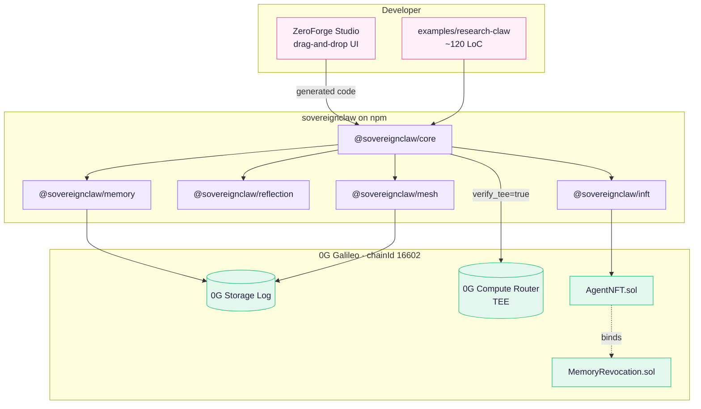

# ZeroForge, your sovereignclaw 

> **Open-source, sovereign-memory, multi-agent, iNFT-native agent
> framework for 0G.** Encrypted memory on 0G Storage, TEE-attested
> inference on 0G Compute, ERC-7857 iNFT lifecycle with **1.5 s
> cryptographic revocation**, and a drag-and-drop visual builder
> that compiles to the same code an engineer would write by hand.

[](https://github.com/irajgill/sclaw/actions/workflows/ci.yml)
[](LICENSE)
[](https://chainscan-galileo.0g.ai/)
[](https://www.npmjs.com/package/@sovereignclaw/core)
[](https://www.npmjs.com/package/@sovereignclaw/memory)
[](https://www.npmjs.com/package/@sovereignclaw/inft)
[](https://www.npmjs.com/package/@sovereignclaw/mesh)
[](https://www.npmjs.com/package/@sovereignclaw/reflection)

**ZeroForge** is the visual side of the **sovereignclaw** stack: a
Next.js drag-and-drop builder + light, playful UX that compiles the
same TypeScript a senior engineer would write by hand, then deploys
a sovereign agent to 0G Galileo in one click.

## Live

| Surface | URL |
| --- | --- |
| **ZeroForge Studio** (drag-and-drop builder + landing demo) | https://sclaw-studio-82lp.vercel.app/ |
| **Docs site** | https://sclaw-backend.vercel.app/ |
| **Dev oracle + studio backend** | https://oracle-production-5db4.up.railway.app |
| **Source** | https://github.com/irajgill/sclaw |
| **Companion (Track 2)** | https://github.com/irajgill/IncomeClaw |

## Architecture



## Four snippets above the fold

```bash
# Install — every package available standalone or together
pnpm add @sovereignclaw/core @sovereignclaw/memory @sovereignclaw/inft \
         @sovereignclaw/reflection @sovereignclaw/mesh ethers
```

```typescript
// A sovereign agent in 8 lines: encrypted memory + TEE inference + reflection
import { Agent, sealed0GInference } from '@sovereignclaw/core';
import { encrypted, OG_Log, deriveKekFromSigner } from '@sovereignclaw/memory';
import { reflectOnOutput } from '@sovereignclaw/reflection';

const kek = await deriveKekFromSigner(wallet, 'research-claw-v1');
const memory = encrypted(
  OG_Log({ namespace: 'research-state', rpcUrl, indexerUrl, signer: wallet }),
  { kek },
);
const agent = new Agent({
  role: 'researcher',
  inference: sealed0GInference({
    model: 'qwen/qwen-2.5-7b-instruct',
    apiKey: ROUTER_KEY,
    verifiable: true,
  }),
  memory,
  reflect: reflectOnOutput({ rubric: 'accuracy', persistLearnings: true }),
});
const out = await agent.run('Summarize the three most-cited 2024 RAG papers.');
```

```typescript
// Mint the agent as an ERC-7857 iNFT (one call, real on-chain tx)
import { mintAgentNFT } from '@sovereignclaw/inft';

const { tokenId, txHash, explorerUrl } = await mintAgentNFT({
  agent,
  owner: wallet,
  royaltyBps: 500,
});
```

```typescript
// Cryptographically revoke its memory (DEK zeroed on-chain in ~1.5 s)
import { revokeMemory } from '@sovereignclaw/inft';

await revokeMemory({ tokenId, owner: wallet, oracle });
// AgentNFT.wrappedDEK is now zeros; MemoryRevocation registry updated;
// oracle refuses any future re-encryption for tokenId.
```

## Quickstart — clone → sovereign iNFT in <90 seconds

```bash
git clone https://github.com/irajgill/sclaw.git
cd sclaw && cp .env.example .env
# fill PRIVATE_KEY (faucet.0g.ai) and COMPUTE_ROUTER_API_KEY (pc.testnet.0g.ai)

pnpm install
( cd contracts && forge install foundry-rs/forge-std --no-git \
                       && forge install OpenZeppelin/openzeppelin-contracts --no-git \
                       && forge build )
pnpm --filter @sovereignclaw/core --filter @sovereignclaw/memory \
     --filter @sovereignclaw/reflection --filter @sovereignclaw/inft build

cd examples/research-claw && pnpm dev
```

Prints a TEE-verified inference, a self-critique with a learning
pointer, four encrypted 0G writes, and a chainscan URL for your
freshly-minted ResearchClaw iNFT. Full path:
[docs/quickstart.md](docs/quickstart.md).

For the visual builder locally:

```bash
# terminal 1 — backend (oracle + /studio/deploy) on :8787
pnpm --filter @sovereignclaw/backend dev

# terminal 2 — Studio on :3030
pnpm --filter @sovereignclaw/studio dev
```

## Deployed contracts (0G Galileo, chainId 16602)

| Contract | Address |
| --- | --- |
| AgentNFT | [`0xc3f997545da4AA8E70C82Aab82ECB48722740601`](https://chainscan-galileo.0g.ai/address/0xc3f997545da4AA8E70C82Aab82ECB48722740601) |
| MemoryRevocation | [`0x735084C861E64923576D04d678bA2f89f6fbb6AC`](https://chainscan-galileo.0g.ai/address/0x735084C861E64923576D04d678bA2f89f6fbb6AC) |

Run `pnpm check:deployment` to assert the live contracts match the
committed record at
[deployments/0g-testnet.json](deployments/0g-testnet.json).

## 0G features used

| Layer | Where |
| --- | --- |
| **Storage Log** | `@sovereignclaw/memory` (`OG_Log`) and `@sovereignclaw/mesh` event bus — encrypted (AES-256-GCM, KEK from wallet sig) |
| **Compute Router** | `@sovereignclaw/core` (`sealed0GInference`) — `verify_tee: true` returns a typed `Attestation` on every result |
| **EVM chain** | `AgentNFT.sol` + `MemoryRevocation.sol` — `transferWithReencryption`, `revoke`, `recordUsage` are all real txs on chainscan-galileo |
| **ERC-7857** | `@sovereignclaw/inft` — mint / transfer / revoke / recordUsage helpers; EIP-712 oracle proofs with per-token monotonic nonces |

## Tests

```bash
pnpm contracts:test           # 77 Foundry tests, 7 suites, 128k invariant calls/property
pnpm contracts:snapshot:check # gas regression gate
pnpm test                     # 123 Vitest unit suites across the workspace
pnpm benchmark:loc --check    # LoC budget gate (gated in CI)
INTEGRATION=1 pnpm --filter @sovereignclaw/inft test:integration
pnpm check:deployment         # read-only on-chain assertions
```

Full benchmarks (cold-start, inference RTT, revoke latency, mesh
throughput, LoC) in [docs/benchmarks.md](docs/benchmarks.md).
Audit-grade trust model in [docs/security.md](docs/security.md).

## License

Apache 2.0. See [LICENSE](LICENSE) and [NOTICE](NOTICE).
